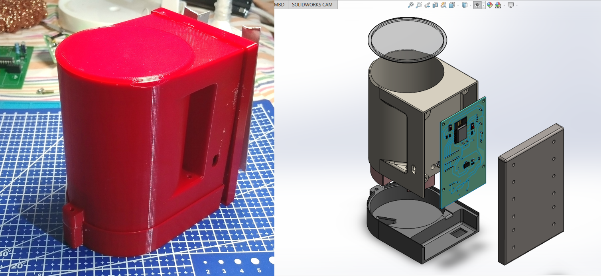
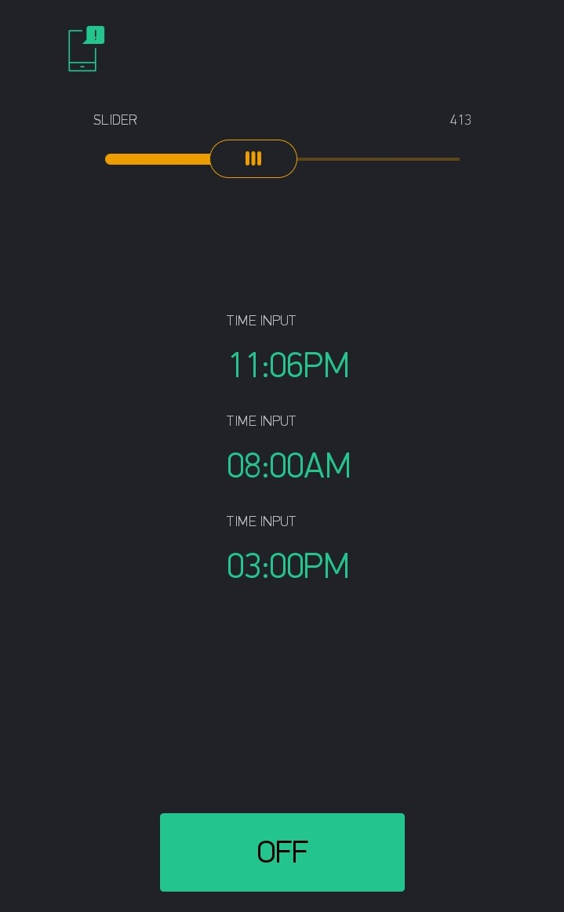
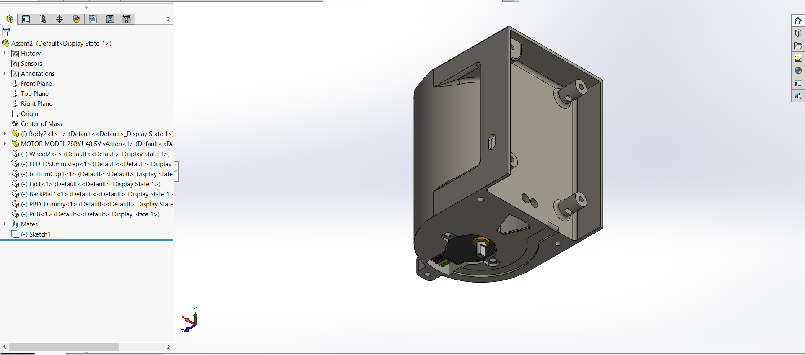
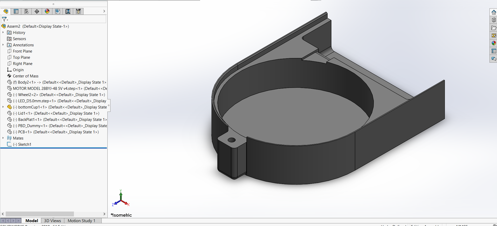
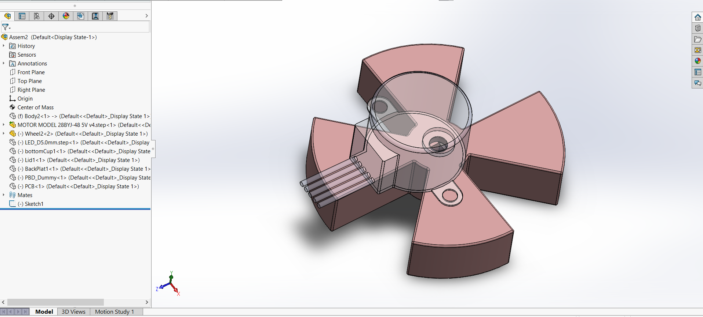
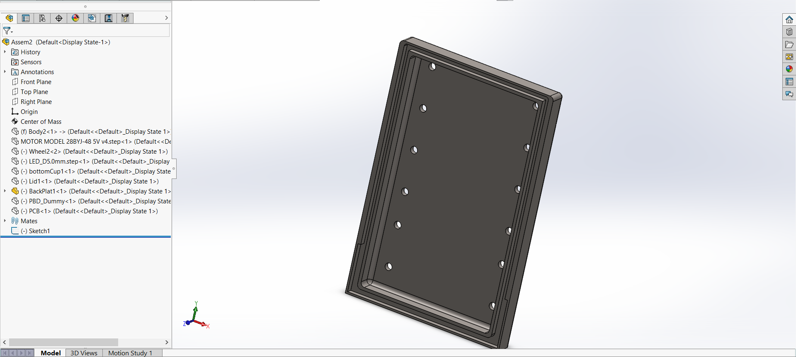
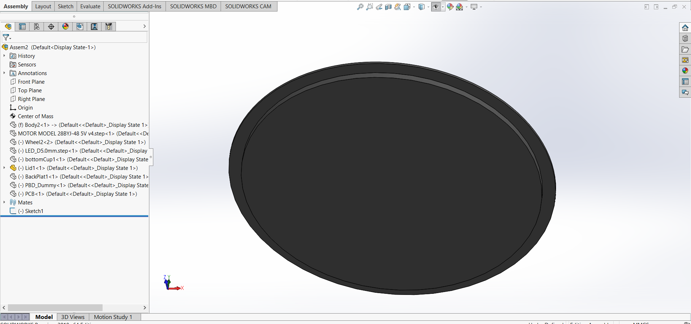
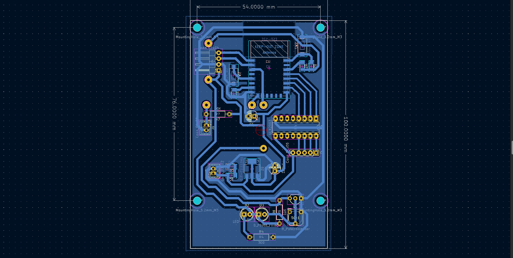
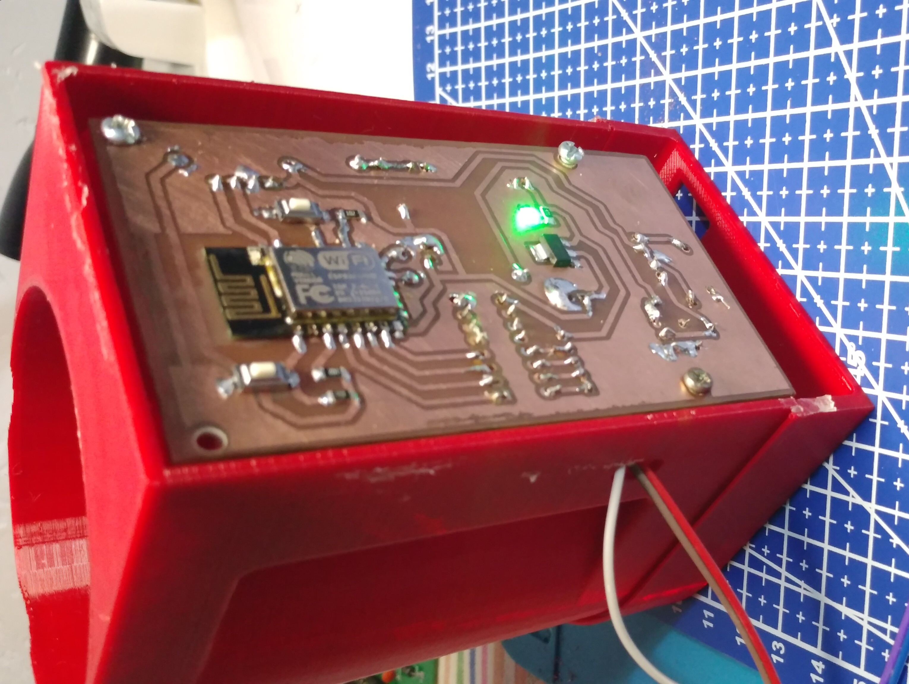

# **IOT Based fish feeder**
---
## **Introduction**

The IOT Based fish feeder is a small device which is design for aquarium industry. Specially for the small and lag scale fish farms, which need lot of man power to feed the fish in time. This is one of the biggest challenge face by the fish farm owners. This device will helps to feed the fish in time. The IOT based fish feeder is consists of two parts, the hardware and a mobile application to setup and control the device. The following topic will cover these parts in farther more details and also the operation of the device.  

## **1. Mobile Application**

The mobile application is build by using the Blink IOT platform. It is a very nice platform which helps to create mobile applications for IOT projects without any needs of app development knowledge. The following figure show the screenshot of my prototype app.

The slider at the top use to control the amount of food feed to the fish tank. At the bottom of the app there is a button to feed the fish manually. By pressing this button the device will put fish food manually to tank. In middle the application there are 3 timers which can set accordingly by user. There are three timers on this app.

## **2. Hardware**      
 The hardware part also can be divided in to two parts. Mechanical design and Electrical design.

### **2.1 Mechanical design**

The mechanical design part contain all the mechanical system and the enclosure of the device. Mainly there are 5 parts in the mechanical system.

1. Body
1. Bottom Plate
1. Segmented Wheel
1. Back Plate
1. Lid

Following images show the individual CAD design of each part.

1. Body

2. Bottom Plate

3. Segmented Wheel

4. Back Plate

5. Lid

### **2.2 Electrical design**

1. BOM of the electrical design.
1. 24BYJ48 DC 5V Reduction Stepper Motor
1. UL2003
1. LED
1. IR LED
1. IR photo diode.
1. 2N7000 MOSFET
1. ESP8266
1. AMS1117 3.3
1. 100uF Capacitors
1. 50k potentiometer 
1. 300 Resistor
1. 10k Resistor
1. Pin Headers.

  
The Stepper motor is fixed to body. All the other components are placed on a PCB. 5V needed for the PCB to properly operate. This 5V is given by a external power source.  The PCB is a single layer PCB. The  following images shows the PCB design. and the prototype PCB. 

